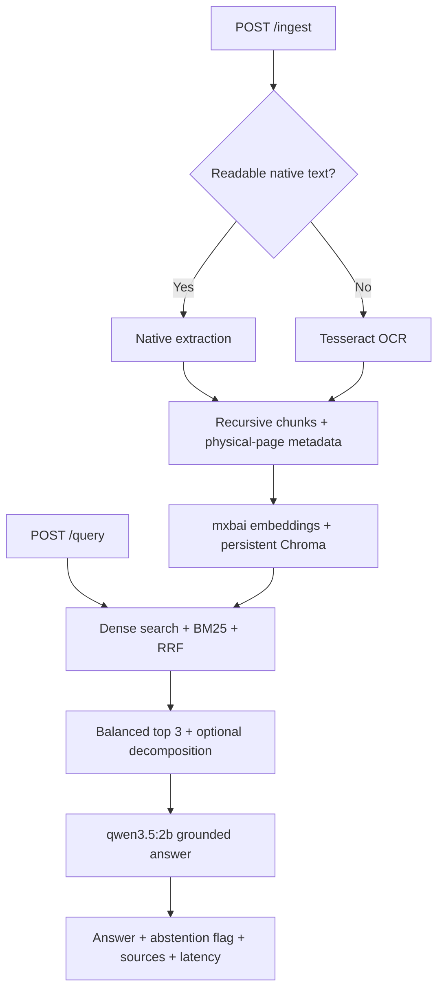

# Local Production RAG System

This repository contains a local, end-to-end retrieval-augmented generation system for native PDFs, scanned PDFs, images, DOCX files, and UTF-8 text documents. It exposes document ingestion and grounded question answering through FastAPI, stores embeddings in persistent Chroma, and runs both embedding and generation models locally through Ollama.

The promoted text architecture is:

> Selective OCR → recursive `1000/200` character chunks → `mxbai-embed-large` → Chroma cosine search + BM25 → equal-weight reciprocal-rank fusion → balanced top-three physical pages → deterministic decomposition for explicit compound questions → grounded `qwen3.5:2b` generation.

The multimodal figure branch is documented as an experiment, not as production functionality. Its automatic scores improved sharply, but manual review found incorrect diagram relationships and the final repair run is incomplete.

## Architecture



## Requirements

- Python 3.12 recommended.
- [Ollama](https://docs.ollama.com/) running locally.
- `mxbai-embed-large` and `qwen3.5:2b` installed in Ollama.
- Tesseract OCR with English data for scanned PDFs and images.
- About 8 GB RAM is workable because the API unloads one Ollama model before loading the other. Requests are serialized deliberately to avoid memory contention.

## Setup on Windows

From this repository folder:

```cmd
python -m venv .venv
.venv\Scripts\activate
python -m pip install --upgrade pip
python -m pip install -r requirements.txt
ollama pull mxbai-embed-large
ollama pull qwen3.5:2b
tesseract --version
```

If Tesseract is installed but not on `PATH`:

```cmd
set TESSERACT_CMD=C:\Program Files\Tesseract-OCR\tesseract.exe
```

Start the API:

```cmd
python -m uvicorn app.main:app --host 127.0.0.1 --port 8000 --reload
```

Open the interactive API documentation at `http://127.0.0.1:8000/docs`.

## Use the API

Ingest a document:

```cmd
curl.exe -X POST "http://127.0.0.1:8000/ingest" -F "file=@data\corpus\nist_ai_rmf_1_0.pdf"
```

Ask a question:

```cmd
curl.exe -X POST "http://127.0.0.1:8000/query" -H "Content-Type: application/json" -d "{\"question\":\"What are the four functions in the AI RMF Core?\"}"
```

Check index health:

```cmd
curl.exe "http://127.0.0.1:8000/health"
```

The ingestion response reports page and chunk counts, plus how many pages required OCR. The query response returns the grounded answer, an explicit `abstained` Boolean, physical-page sources, whether decomposition was applied, and retrieval/generation latency.

Supported uploads are PDF, DOCX, PNG, JPEG, TIFF, BMP, TXT, Markdown, CSV, JSON, HTML, XML, and RST. The default upload limit is 50 MB. Re-uploading identical bytes replaces the existing vectors instead of creating duplicates.

See [docs/API.md](docs/API.md) for the complete contract and error behavior.

## Evaluation

The frozen evaluation set has 30 questions: 26 answerable and 4 deliberately unanswerable. It covers direct, paraphrased, multi-page, OCR, OCR compound, and refusal cases over three NIST documents.

The exact experiment history is in [evaluation/experiment_log.csv](evaluation/experiment_log.csv). The main result is not that every advanced technique helped; several did not.

| Experiment | Retrieval recall | Fact recall | Citation F1 | Unanswerable | p95 total |
|---|---:|---:|---:|---:|---:|
| Native-text dense baseline, top 3 | 59.62% @3 | 51.47% | 51.92% | 50% | 37.42 s |
| Selective OCR dense, top 3 | 75.00% @3 | 66.26% | 66.67% | 100% | 37.61 s |
| Dense top 5 | 82.69% @5 | 69.98% | 71.03% | 75% | 71.66 s |
| Hybrid RRF, top 3 | 82.69% @3 | 68.90% | 72.44% | 100% | 44.06 s |
| Balanced hybrid, top 3 | 88.46% @3 | 67.57% | 70.38% | 100% | 34.07 s |
| Decomposed balanced hybrid, top 3 | 88.46% @3 | 68.89% | 70.64% | 75% | 36.88 s |
| PRF + decomposed hybrid, top 3 | 88.46% @3 | 68.84% | 68.08% | 100% | 34.17 s |
| Smaller `500/100` chunks, top 3 | 90.38% @3 | 59.37% | 75.51% | 75% | 33.72 s |

The stored decomposed prediction artifact scores 75% on the four unanswerable questions. Any claim that this exact artifact achieved 100% abstention is wrong. Balanced hybrid achieved 100%; decomposition raised fact recall but introduced one refusal regression. The API keeps targeted decomposition because it improves explicit multi-part evidence collection, while exposing abstention explicitly and documenting this limitation.

Physical PDF pages are the citation unit. Use `evaluation/gold_questions_physical_pages.jsonl`; the older `gold_questions.jsonl` uses printed publication numbering and produces invalid retrieval/citation comparisons.

Run the evaluator against a saved prediction file:

```cmd
python evaluation\metrics.py --gold evaluation\gold_questions_physical_pages.jsonl --predictions results\predictions.jsonl --output results\metrics.json
```

## Tests

Install development dependencies and run:

```cmd
python -m pip install -r requirements-dev.txt
python -m unittest discover -s tests -v
python -m compileall app tests
```

The tests cover deterministic decomposition, BM25 exact-term behavior, reciprocal-rank fusion, page-balanced selection, and the FastAPI endpoint contract with a fake service. A real end-to-end smoke test additionally requires Ollama, both local models, and Tesseract for scanned inputs.

With the API running, execute a real ingest-and-query smoke test:

```cmd
python scripts\smoke_test_api.py data\corpus\nist_ai_rmf_1_0.pdf "What are the four functions in the AI RMF Core?"
```

## Configuration

| Variable | Default | Purpose |
|---|---|---|
| `RAG_DATA_DIR` | `./data` | Persistent uploads and Chroma files |
| `RAG_COLLECTION` | `production_documents` | Chroma collection name |
| `RAG_EMBEDDING_MODEL` | `mxbai-embed-large` | Ollama embedding model |
| `RAG_GENERATION_MODEL` | `qwen3.5:2b` | Ollama answer model |
| `RAG_CHUNK_SIZE` | `1000` | Chunk size in characters |
| `RAG_CHUNK_OVERLAP` | `200` | Character overlap |
| `RAG_DENSE_K` | `20` | Dense candidate pool |
| `RAG_BM25_K` | `20` | BM25 candidate pool |
| `RAG_FINAL_K` | `3` | Final distinct-page context budget |
| `RAG_MAX_UPLOAD_BYTES` | `52428800` | Upload limit |
| `RAG_OCR_DPI` | `300` | PDF render resolution for OCR |
| `RAG_OCR_LANGUAGE` | `eng` | Tesseract language |
| `TESSERACT_CMD` | auto-detected | Explicit Tesseract executable |

## Project map

```text
app/                         FastAPI application and RAG implementation
tests/                       Retrieval and HTTP contract tests
data/corpus/                 Frozen NIST benchmark corpus
evaluation/                  Gold questions, scorer, tests, experiment log
results/                     Preserved metric artifacts
scripts/prepare_corpus.py    Reproducible corpus preparation
scripts/smoke_test_api.py    Live ingestion/query smoke test
docs/API.md                  REST contract
docs/REPORT.md               Full assignment journey and decisions
```

## Honest scope

The text API is implemented. It provides persistent ingestion, selective OCR, chunking, embedding, hybrid retrieval, grounded generation, citations, and explicit abstention.

This is still a local single-process system. It serializes expensive operations, rebuilds the small in-memory BM25 index per query, and has no authentication or multi-user isolation. Those choices fit the assignment and the 8 GB target machine; they would need redesign for a concurrent public deployment.

The multimodal visual branch remains experimental and is not connected to the production API. See [docs/REPORT.md](docs/REPORT.md) for the measured reason.
